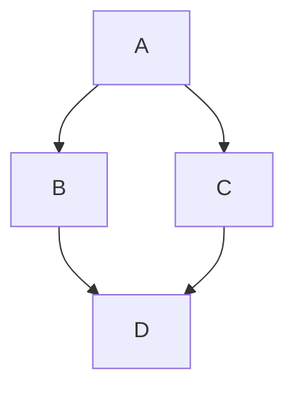

# This is a test page.

# First Level


## First Next Level

1.  First bullet.
2.  Second bullet.
3.  Third bullet.


# Second Level


## Math formula

This sentence uses `$` delimiters to show math inline: $\sqrt{x}+(1+x)^2$.

Let $f\colon[a,b]\to\R$ be Riemann integrable. Let $F\colon[a,b]\to\R$ be
$F(x)=\int_{a}^{x} f(t)\,dt$. Then $F$ is continuous, and at all $x$ such that
$f$ is continuous at $x$, $F$ is differentiable at $x$ with $F'(x)=f(x)$.

```math
I = \int_0^{2\pi} \sin(x)\,dx
```

$$
I = \int_0^{2\pi} \sin(x)\,dx
$$

## Code blocks

```jsx title="/src/components/HelloCodeTitle.js"
function HelloCodeTitle(props) {
  return <h1>Hello, {props.name}</h1>;
}
```

```js
console.log('Every repo must come with a mascot.');
```

## Admonition

:::note

Some **content** with _Markdown_ `syntax`. Check [this `api`](#).

:::

:::tip

Some **content** with _Markdown_ `syntax`. Check [this `api`](#).

:::

:::info

Some **content** with _Markdown_ `syntax`. Check [this `api`](#).

:::

:::warning

Some **content** with _Markdown_ `syntax`. Check [this `api`](#).

:::

:::danger

Some **content** with _Markdown_ `syntax`. Check [this `api`](#).

:::

## Mermaid diagram



{/*  LocalWords:  sqrt */}
